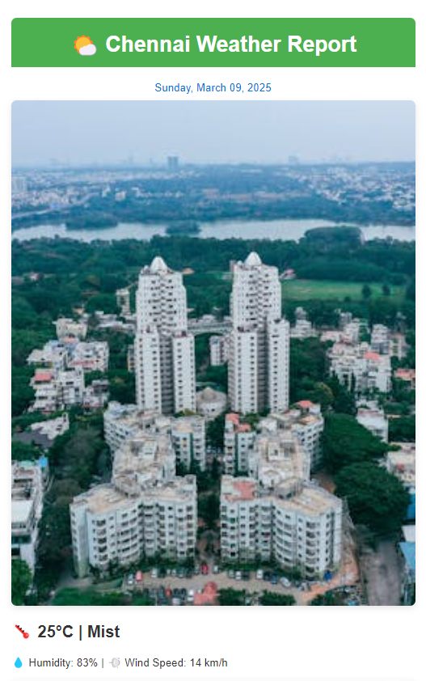
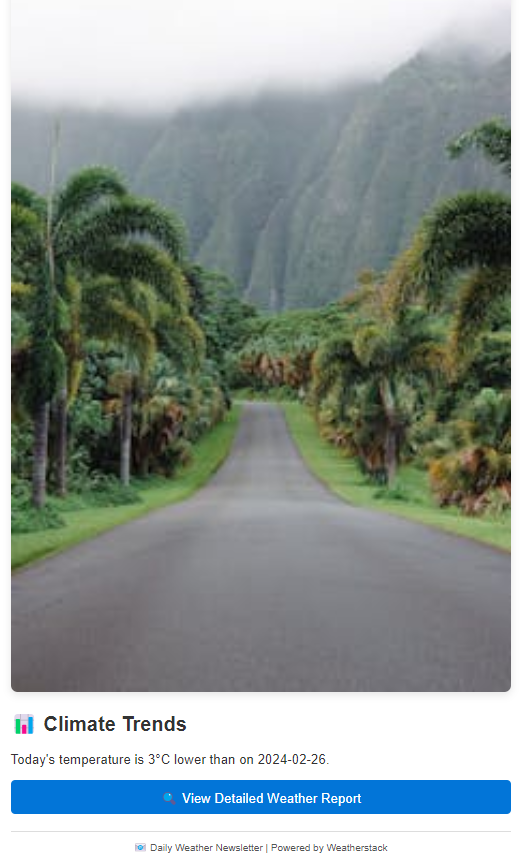
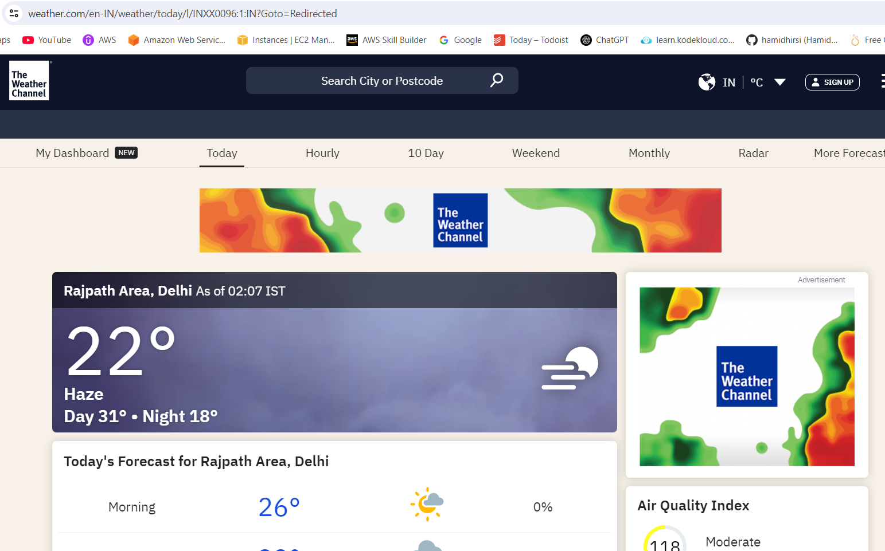
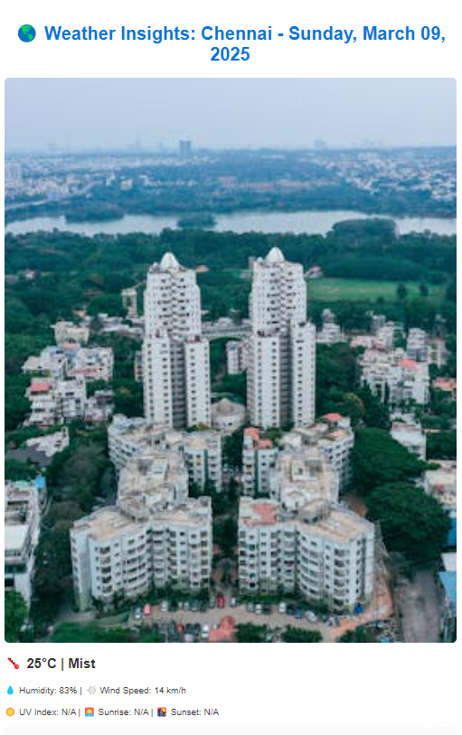
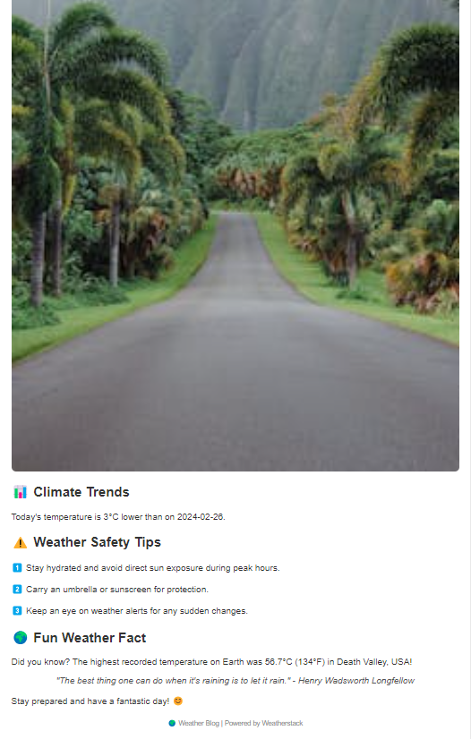

# 🌦️ Weather Vlog, Blog, and Newsletter Automation

This project automates the creation of weather vlogs, blogs, and newsletters by integrating weather data, visuals, text narration, and video generation. It simplifies the content creation workflow with minimal manual intervention.

---

## 🚀 Features

✅ Automated weather data fetching  
✅ Dynamic text script generation based on weather insights  
✅ Image fetching via Pexels API for enhanced visuals  
✅ Climate trend analysis using historical data  
✅ Automated newsletter and blog post creation  
✅ AI-narrated video with text overlays  

---

## 🛠️ Tools and Technologies Used

- **Python** - Core language for automation logic  
- **MoviePy** - For video editing and overlay generation  
- **Pexels API** - For fetching relevant weather and city images  
- **Weatherstack API** - For fetching real-time weather data  
- **Pdfkit** - For converting HTML to PDF  
- **NLTK, NLP, and Olama Mistral Model** - For generating text scripts using AI language capabilities  
- **Pyttsx3** - For converting text to speech (AI narration)  

---

## 🏗️ Project Structure

```
├── media
│   ├── images
│   │   └── [date]
│   ├── narration.mp3
│   ├── default_weather.jpg
│   ├── default_city.jpg
│   └── output.mp4
├── scripts
│   ├── fetch_weather.py
│   ├── generate_script.py
│   ├── create_video.py
│   ├── fetch_image.py
│   ├── generate_newsletter.py
│   ├── analyze_climate.py
│   └── generate_blog.py
├── main.py
└── requirements.txt
```

---

## ⚙️ Prerequisites

Before running the project, ensure you have the following installed:

- **Python 3.10+**  
- **Ollama for Windows**  
- **Pdfkit** (for HTML to PDF conversion)  
- **ImageMagick** (for text rendering in `moviepy`)  

### Install Required Libraries

```bash
pip install -r requirements.txt
```

### Important Configuration Step

Before running `python main.py`, replace the following line in `venv\Lib\site-packages\moviepy\video\fx\resize.py`:

**Original:**
```python
resized_pil = pilim.resize(newsize[::-1], Image.ANTIALIAS)
```

**Updated:**
```python
resized_pil = pilim.resize(newsize[::-1], Image.LANCZOS)
```

### API Key Configuration
Ensure to update the API keys in the following scripts:
- `fetch_weather.py`
- `create_video.py`
- `download_images.py`
- `generate_blog.py`
- `generate_newsletter.py`

---

## 📄 Configuration

Ensure `ImageMagick` is correctly set up by updating the following path in `main.py` if needed:

```python
change_settings({"IMAGEMAGICK_BINARY": "C:\\Program Files\\ImageMagick-7.1.1-Q16-HDRI\\magick.exe"})
```

---

## ▶️ Usage

To run the complete workflow:

```bash
python main.py
```

### Output
✅ Newsletter will be generated in `/newsletter/weather_newsletter.html` and `/newsletter/weather_newsletter.pdf`  
✅ Blog post will be saved in `/blog/index.html` and `/blog/weather_blog.pdf`  
✅ Final Vlog video will be saved as `/media/output.mp4`  

---

## 📸 Sample Output

### Newsletter Screenshot







### Blog Screenshot





### Vlog Output

🎬 [Watch the Vlog Video](media/output.mp4)

---

## 🔧 Troubleshooting

**1. Image Fetch Failure**  
- If the Pexels image fetch fails, the system will automatically switch to fallback images.

**2. Video Creation Issues**  
- Ensure `ImageMagick` path is configured correctly in `main.py`.

**3. Missing Libraries**  
- Run `pip install -r requirements.txt` to install dependencies.

---

## 💬 Feedback & Contributions
Contributions are welcome! Feel free to submit pull requests or report issues.

For queries, contact **Naveen** via **snaveenkpn@gmail.com**.

